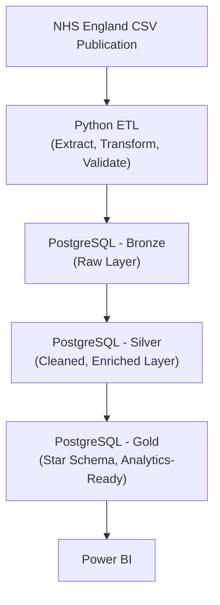

NHS A&E Data Warehouse

An end-to-end analytics engineering project that ingests NHS England's public Accident & Emergency attendance data, transforms it through a medallion architecture in PostgreSQL, and prepares it for analysis in Power BI.

The project covers twelve months of national A&E performance data (April 2025 to March 2026) across roughly 200 NHS trusts, walk-in centres, and urgent treatment centres.

Why this project

NHS A&E performance is a widely reported and operationally important dataset, but the raw publications are not analysis-ready. Provider types are mixed together, some months use inconsistent number formatting, and comparing every provider against every other provider produces misleading conclusions. This project builds a proper data warehouse around the dataset so that meaningful comparisons — major emergency departments against major emergency departments, not against specialist units with no A&E department at all, become straightforward.

# Architecture




 

The warehouse follows a medallion architecture with three schemas:


* Bronze — raw data, minimally cleaned, one row per provider per month, loaded exactly as published
* Silver — cleaned and enriched with ICB and regional lookups, still one row per provider per month
* Gold — a dimensional star schema (fact_ae_monthly linked to dim_provider, dim_date, and dim_icb) built specifically for reporting and analysis


Python's job is to move and validate data. SQL's job is to transform and model it. Keeping that division clean made the pipeline far easier to debug and extend.

The star schema

                    dim_date
                        │
                        │
dim_provider ───── fact_ae_monthly ───── dim_icb
                                           
                                           
``` 


'dim_provider' includes a derived classification ('provider_type') that does not exist in the source data — Major Emergency Department, Single Specialty A&E, Minor Injury Unit / UTC, or Specialist Provider, based on which types of A&E activity each provider reports. This was a deliberate modelling decision: NHS A&E publications include everything from major trauma centres to single-room walk-in centres, and benchmarking a specialist orthopaedic hospital against Barts Health NHS Trust produces meaningless results. Adding this dimension makes like-for-like comparison possible in the downstream dashboard.

Repository structure

```mermaid

NHS_AE_Project/
│
├── data/
│   └── raw/
│       ├── ae_attendances/       12 monthly NHS CSV publications
│       └── system_mapping/       Provider-to-ICB reference data
│
├── sql/
│   ├── bronze/                   Raw layer table definitions
│   ├── silver/                   Cleaning and enrichment logic
│   ├── gold/                     Star schema: dimensions and fact table
│   └── validation/               Row count and data quality checks
│
├── python/
│   ├── main.py                   Pipeline orchestration
│   ├── config.py                 Paths, database settings, environment loading
│   └── etl/
│       ├── extract.py            File discovery, chronological sorting, reading
│       ├── transform.py          Column standardisation, numeric cleaning
│       ├── validate.py           Schema and data quality checks
│       └── load.py               PostgreSQL loading
│
├── docs/
│   ├── data_dictionary.xlsx
│   └── data_model.docx
│
├── requirements.txt
└── README.md

```

```
The ETL pipeline

The Python pipeline automates what would otherwise be twelve rounds of manual CSV import:


1. Extract — locates every monthly CSV in the raw data folder and sorts them chronologically by parsing the reporting month directly from the filename (April-2025-AE.csv  to 30 April 2025), rather than relying on alphabetical file order
2. Transform — standardises inconsistent column headers, renames fields to a consistent naming convention, and cleans numeric fields
3. Validate — checks required columns are present, the file is not empty, no trust codes are missing, and no trust code is duplicated within a single month's file
4. Load — truncates and reloads the Bronze layer via SQLAlchemy, ready for the SQL transformations that build Silver and Gold

```

Each function has a single responsibility, which made it possible to isolate and fix data quality problems (below) without rewriting the whole pipeline each time.

### Data quality problems found and fixed

NHS publications are not perfectly consistent month to month. Building the validation layer surfaced several real issues that a naive pd.read_csv and INSERT approach would have loaded silently:


* Corrupted hyphens. Several months' column headers (and some data values, such as provider names) had hyphens replaced with the digit 0 — likely an encoding artifact from the source publishing tool. Left unhandled, this silently broke column mapping for the affected months.
* Inconsistent numeric formatting. Some months represented large numbers with thousands separators as strings ("16,670"), and some percentage fields included a trailing % or a - placeholder for missing data. The transform layer normalises all of this into proper nullable numeric types before it reaches PostgreSQL.
* Provider churn. The set of reporting providers isn't static — new walk-in centres and urgent care centres appear partway through the year. Building the provider dimension from a single month's snapshot silently dropped these providers from later months. The fix was rebuilding dim_provider from the full twelve-month history, and explicitly flagging providers absent from the reference mapping data (via an UNMAPPED placeholder) rather than letting them disappear from the warehouse without a trace.

```
Key findings

A few things the warehouse and dashboard surfaced that were worth digging into rather than taking at face value:


** Major Emergency Departments carry almost all of the pressure. Across the full twelve months, Major EDs averaged around 70-75% of patients seen within four hours, while Minor Injury Units and Single Specialty A&E consistently ran at 90-100%. Blending these together into one national average — as the headline NHS figure does — masks a genuine, sustained performance gap between department types. This is the direct motivation for building provider_type as a derived dimension rather than relying on the raw data alone.
** The lowest-performing individual trust in the dataset was East Cheshire NHS Trust, averaging 48.4% seen within four hours across the period — around 30 percentage points below the Major ED average. Investigating outliers like this would be a natural next step: is it a genuine, sustained operational issue, or a temporary dip during a specific incident?
** Not every row in the source data represents an active A&E service. Several providers report zero attendances across every field — these are trusts (often community or mental health providers) that submit a return for completeness despite not operating emergency departments. Left unfiltered, these providers appeared as "worst performers" in a naive ranking, when in reality they don't provide the service being measured at all. This shaped how the provider ranking table is filtered.
** National April 2025 performance genuinely was a low point. not a pipeline artefact — cross-checked against Nuffield Trust reporting, which shows NHS England missed its 76% interim objective for March 2025, consistent with the low starting point seen in this dataset the following month.
**Boarding delay (the wait between a decision to admit and an actual bed becoming available) is functionally a Major Emergency Department problem alone. Across the full twelve months, Major EDs accounted for over 99.5% of all emergency admissions nationally (6.42 million of roughly 6.45 million) — Minor Injury Units, Single Specialty A&E, and Specialist Providers together made up under 0.5%. As a result, national 4-hour and 12-hour boarding delay figures are, in practice, almost entirely a Major ED metric. This sharpens the earlier finding on 4-hour front-door performance: Major EDs are not only the weakest performers at initial treatment, they also carry essentially the entire national burden of bed-availability pressure once a patient has been accepted for admission.

```

### Tech stack


* Python — pandas, SQLAlchemy, psycopg2
* PostgreSQL — three-schema medallion architecture, star schema modelling, surrogate and natural keys, foreign key constraints
* Power BI — downstream analysis and dashboarding (in progress)
* Git / GitHub — version control

```
Running the pipeline

powershell# Clone and enter the project
git clone https://github.com/edwardchede/nhs-ae-data-warehouse.git
cd nhs-ae-data-warehouse

# Set up a virtual environment
python -m venv .venv
.venv\Scripts\Activate

# Install dependencies
pip install -r requirements.txt

# Set your database password
# Create a .env file in the project root containing:
# NHS_AE_DB_PASSWORD=your_postgres_password

# Run the SQL scripts in sql/bronze, sql/silver, sql/gold in order
# to build the schema, then:

cd python
python main.py

```

Status

```
 [x] Bronze, Silver, and Gold schemas designed and built
 [x] Automated Python ETL pipeline (extract, transform, validate, load)
 [x] Twelve months of data loaded and validated end to end
 [x] Version controlled with Git
 [x] Power BI dashboard
 [x] Data quality validation suite committed as SQL scripts
```

Author

Edward Chede — MSc Applied Data Science (Teesside University). Built as a portfolio project, with a focus on NHS and public sector data.